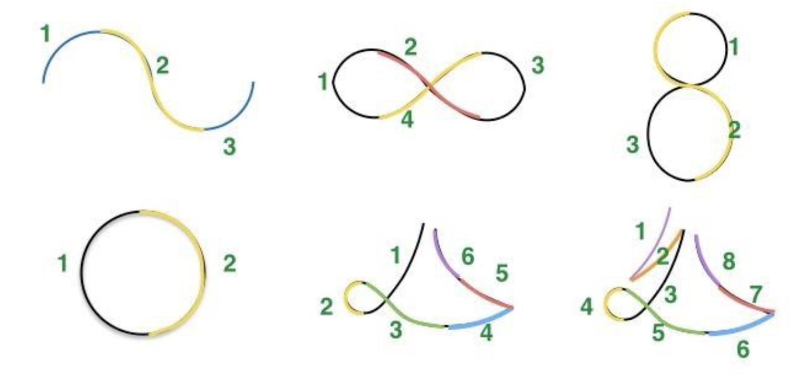

# Gesture Recognition

Recognize different gestures from an IMU device, such as a flying drone or a mobile phone, using Hidden Markov Model. See `Project Report.pdf` for full detail.

## How to run

### To predict:

- Put test files in 'Test' folder
- Run this command in Terminal:
'python predict.py'

### If you want to re-train the models:

- Put train files in 'Train' folder
- Run this command in Terminal:
'python train.py' 
